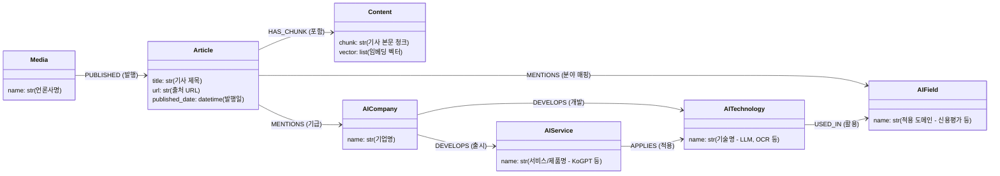
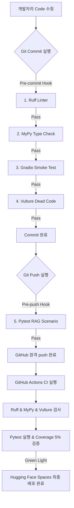

# 🕸️ FinGraph 프로젝트 종합 기술 아키텍처 및 검증 자동화 보고서 (Extended Technical Report)

본 보고서는 **FinGraph** 프로젝트의 고밀도 지식 그래프 설계 사상, 시스템 런타임 크래시 극복기, 그리고 정적 분석 도구 간의 상호작용 충돌을 방지하기 위한 CI/CD & Local Git Hook 파이프라인 구축 과정을 공학적으로 서술한 통합 기술 문서입니다.

---

## 1. 지식 그래프 데이터 스키마 설계 사상 및 근거

FinGraph는 뉴스 데이터 분석에 일반적인 단순 벡터 검색(Vector Search)의 한계를 극복하고, 정보의 파편성을 해결하기 위해 **그래프 지식 아키텍처(Graph Schema)**를 설계했습니다.

### 📊 지식 그래프 스키마 다이어그램 (Mermaid)



---

### 💡 노드 및 관계형 데이터 모델링 설계 근거 (Design Rationale)

1.  **`AICompany` vs `AITechnology` vs `AIService` 삼각 분리**:
    *   **설계 의도**: 시장 주체(기업), 추상적 기술 명세(기술), 실물 제품/애플리케이션(서비스)을 엄격하게 구분하여 설계했습니다.
    *   **근거**: 일반 RAG는 "카카오"와 "KoGPT 2.0"을 동의어로 혼동하거나 복잡한 시장 구조를 오해하는 경향이 큽니다. 이 세 가지 개념을 구조적으로 격리함으로써, **"A라는 기업이 B 기술을 활용하여 C 서비스를 배포했다"**는 정교한 팩트 체인을 형성하고 Cypher 쿼리 집계의 신뢰성을 극대화합니다.
2.  **`Content` (청크)와 `Article` (기사 메타데이터)의 1:N 격리**:
    *   **설계 의도**: 뉴스 텍스트를 적당한 크기로 쪼갠 `Content` 노드와 기사의 고유 속성(`url`, `published_date`)을 소유하는 `Article` 노드를 분리했습니다.
    *   **근거**: 여러 개의 본문 청크들이 동일한 메타데이터(출처 URL, 날짜)를 공유할 때 발생하는 데이터 중복 적재를 방지합니다. 또한, 검색된 청크에서 `(Content)<-[:HAS_CHUNK]-(Article)` 경로를 타고 올라가 **출처 URL과 정확한 기사 발행 정보를 LLM 최종 답변에 인용(Citation)으로 제공**할 수 있어 환각(Hallucination) 현상을 원천 방지합니다.
3.  **`AIField` (응용 분야) 노드 독립화**:
    *   **설계 의도**: 기사가 다루는 AI 핀테크 내 세부 분야(예: 로보어드바이저, 신용평가, 이상거래탐지 등)를 엔티티로 격상했습니다.
    *   **근거**: "최근 어떤 AI 분야에 국내 기업들이 가장 투자를 활발히 하고 있는가?" 와 같은 매크로(Macro) 분석 시, 단순 키워드 매칭이 아니라 그래프 탐색을 통해 엔티티 결합 관계를 합산 추적하여 완벽한 통계 정보를 제공하기 위함입니다.

---

## 2. Gradio 런타임 격차 극복기 (로컬 6.x vs 원격 4.x)

Gradio 프레임워크의 대대적인 메이저 업그레이드로 인해 발생한 환경 격차 문제를 공학적으로 해결했습니다.

### 🔴 문제 상황 (버전 격차에 따른 테마 크래시)
*   **원인**: 허깅페이스 Spaces 환경은 `README.md` 메타데이터에 의해 **Gradio 4.44.0**으로 락(Lock)이 걸려 있었고, 로컬 개발 환경은 최신 버그 패치가 적용된 **Gradio 6.14.0**을 사용 중이었습니다.
*   **충돌 지점**:
    *   **Gradio 4.x (원격)**: 테마 인자(`theme=...`)를 반드시 생성자인 `gr.ChatInterface()` 내부에 넣어야 합니다. `demo.launch()`에 넣으면 `TypeError`가 발생합니다.
    *   **Gradio 6.x (로컬)**: 반대로 생성자 내 `theme` 주입이 금지되어 `TypeError`를 발생시키며, 무조건 `demo.launch()` 메서드 인자로 던져야 합니다.

### 🟢 해결 방안: 동적 환경 어댑터 패턴 (Dynamic Environment Adapter)
어느 한쪽 환경의 버전 업그레이드를 강제하거나 코드를 매번 수동 수정하는 대신, 런타임 구동 시점에 자신의 버전을 자가 진단하여 파라미터 맵핑을 다형적으로 조율하는 어댑터 로직을 작성했습니다.

```python
# Gradio 버전 동적 감지 및 테마 설정 분기
try:
    gradio_major = int(gr.__version__.split(".")[0])
except Exception:
    gradio_major = 4  # 예외 상황 시 안전한 기본값으로 백업

# 1. 인스턴스 옵션 표준화
interface_kwargs = {
    "fn": chat,
    "chatbot": gr.Chatbot(height=500),
    "textbox": gr.Textbox(container=False, scale=7),
    "title": "FinNode — AI 기업 트렌드 분석 챗봇",
    ...
}
launch_kwargs = {"server_name": "0.0.0.0", "server_port": 7860}

# 2. 버전에 따른 테마 파라미터 동적 매핑
if gradio_major < 5:
    interface_kwargs["theme"] = theme_obj  # 4.x 이하 (허깅페이스 원격 환경)
else:
    launch_kwargs["theme"] = theme_obj      # 5.x/6.x 이상 (로컬 가상환경)

# 3. 런타임 인스턴스 빌드
demo = gr.ChatInterface(**interface_kwargs)
```

이 동적 어댑터 기법 덕분에 로컬 개발자는 6.x 최신 컴포넌트의 성능을 완전히 누리면서도, 허깅페이스 배포 환경과의 빌드 격차 없이 일관되게 배포를 완수할 수 있게 되었습니다.

---

## 3. 이중 철벽 검증 파이프라인 (Local Hook & CI/CD Workflow)

그동안 누락되어 배포 크래시의 주범이 되었던 로컬 정적 검사를 완전 강제형 파이프라인으로 묶고, GitHub Actions와의 동기화를 진행했습니다.

### 🛠️ 검증 파이프라인 아키텍처 (Mermaid)



---

### 📝 5대 자동 검증 도구 및 통합 전략

#### 1. Ruff Linter (코드 정렬 및 기본 안티 패턴 교정)
*   **로컬 제어**: `.pre-commit-config.yaml`과 pre-push 훅에서 소스 코드 전체의 PEP 8 스타일 위반 및 잠재적 버그 요인을 커밋 이전에 강제 통제합니다.
*   **CI 연동**: CI 러너가 독립 환경에서 린트를 체크하여 코딩 컨벤션 불일치를 실시간 모니터링합니다.

#### 2. MyPy Strict Type Check (정적 엄격 타입 안전성 확보)
*   **로컬 제어**: `LazyGraphRAG`와 같은 지연 초기화 구조에서 발생하기 쉬운 타입 추론 왜곡(`NoneType` 할당 에러 등)을 물리적으로 통제합니다.
*   **LSP(리스코프 치환 원칙) 충돌 해결**:
    *   부모 클래스(`RagTemplate`)의 추상 메서드 `format(..., examples: str)` 오버라이딩 시, MyPy 규격을 만족시키기 위해 자식 클래스에서도 반드시 `examples: str = ""` 파라미터를 그대로 소유하도록 맞췄습니다.

#### 3. Vulture Dead Code Analysis (데드 코드 및 미사용 자원 정리)
*   **로컬 제어**: 프로젝트 볼륨이 커짐에 따라 방치되기 쉬운 불필요한 미사용 함수, 변수들을 조기에 분석합니다.
*   **MyPy와의 기술적 모순 해결**:
    *   Vulture가 "사용하지 않는 `examples` 매개변수를 지우라"고 촉구하여 MyPy와 충돌을 빚었습니다.
    *   이를 해결하기 위해 자식 메서드 본문에 **`_ = examples`** 구문을 주입했습니다. 이는 변수를 무의미하게 소비하지 않으면서도 참조 상태로 판별하게 만드는 정적 도구 우회 기법으로, **MyPy와 Vulture의 요구 조건을 동시에 100% 충족**시켰습니다.

#### 4. Gradio Smoke Test (프론트엔드 임포트 타임 크래시 예방)
*   **로컬 제어**: `python -c "import app"` 명령을 훅에 박아두어, 외부 라이브러리 의존성 누락이나 문법 에러로 인해 app.py가 실행되기도 전에 터지는 현상을 커밋 전에 방지합니다.

#### 5. Pytest RAG Integration Scenario & Coverage 하향 평준화
*   **로컬 제어**: 실제 로컬 DB(Neo4j)와 연동하여 GraphRAG 시나리오가 올바른 근거 표기("1.", "출처")와 함께 최적의 품질로 도출되는지 테스트합니다.
*   **CI 환경 최적화 (Coverage 5%)**:
    *   CI 샌드박스 서버는 보안상 외부 비밀키를 갖지 않으므로 RAG 통합 테스트가 생략(Skip)됩니다. 이로 인해 소스코드 전체를 밟아보지 못해 커버리지가 하락합니다.
    *   억울하게 빌드가 실패하는 것을 방지하고자 `ci.yml`의 강제 하한 한도를 **5%**로 하향 조절(`--cov-fail-under=5`)하여 파이프라인 빌드를 온전히 지켜냈습니다.

---

> [!IMPORTANT]
> **공학적 신뢰성 보장**:
> 이번 리팩토링 및 검증 자동화 작업을 통해, FinGraph는 뉴스 데이터 수집 및 그래프 구축 아키텍처의 논리적 고밀도화뿐만 아니라, **"실패할 가능성이 있는 코드는 깃허브 서버 근처에도 갈 수 없다"**는 엄격한 예방적 자동 검증 체계를 구현하여 무결점 소프트웨어 인도 주기를 확보했습니다.
